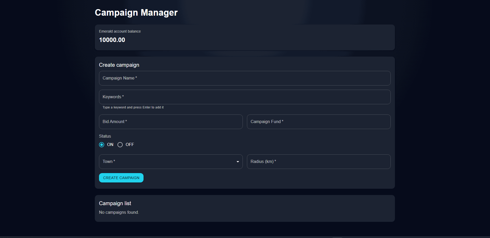

# Campaign Project

Campaign Project is a simple full-stack app for creating and managing campaigns.
It includes account balance tracking, campaign operations, and lookup endpoints.


## What You Can Do

- Create campaigns with basic validation.
- List existing campaigns in a table view.
- Edit or delete campaigns.
- Check account balance details.
- Use backend lookup endpoints from the UI.

## DEMO




## Tech Stack

### Backend

- Java 21
- Spring Boot (Web, Validation, Data JPA)
- H2 in-memory database
- Maven

### Frontend

- React
- Vite
- Material UI
- Axios

## Getting Started

### Prerequisites

- Java 21+
- Maven 3.9+
- Node.js 18+ (or newer LTS)
- npm

### 1) Run Backend

```bash
cd backend
mvn spring-boot:run
```

### 2) Run Frontend

```bash
cd frontend
npm install
npm run dev
```

## Configuration Notes

- The backend uses an in-memory H2 database: `jdbc:h2:mem:campaigndb`.
- H2 console is enabled at `/h2-console`.
- Default server port is `8080`.
- Campaign defaults (like minimum bid and initial balance) are configured in `backend/src/main/resources/application.yml`.

## Project Structure

- `backend/` - Spring Boot REST API and business logic.
- `frontend/` - React UI built with Vite.
- `README.md` - Project documentation.


